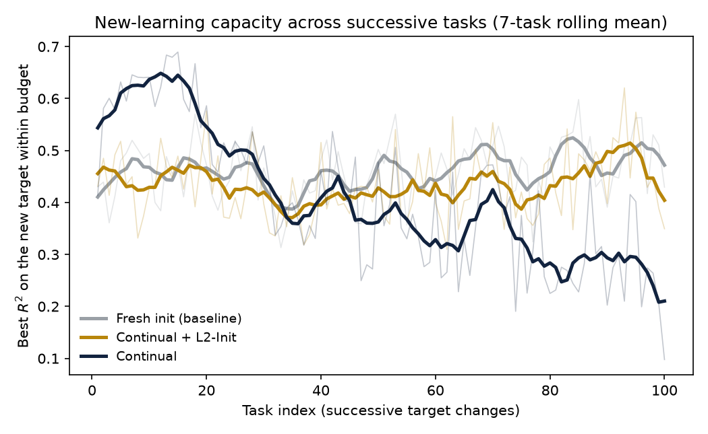
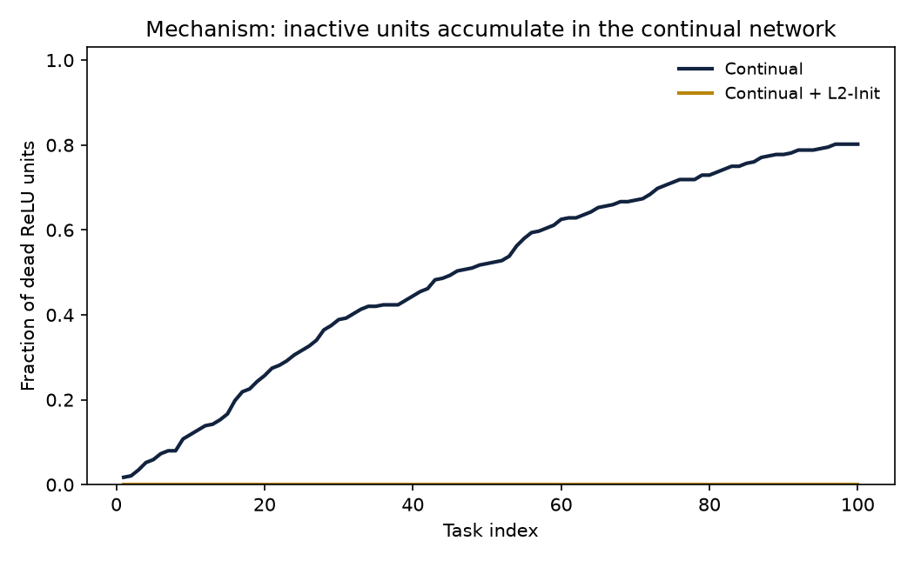

# Study

**Article:** Plasticity Loss in Deep Reinforcement Learning: A Survey

**Authors:** Klein, Luther, McAuliffe, Miklautz, Plant, and Tschiatschek

**DOI/URL:** arXiv:2411.04832v3, 2026

**Replication Type:** Proxy

**Computational Environment:** Python 3.12

**Primary Packages:** NumPy 2.4, pandas 3.0, Matplotlib 3.10

**Random Seed:** 0–5 (six seeds)

**Repository:** https://github.com/sokpheanal/ANLY735-Replication-Lab-02-sokpheanal-huynh

# 1. Research Claim

@klein2026plasticity is a survey, so it reports no original trained model or learning trajectory to reproduce.
It instead synthesizes a phenomenon from the literature: a network trained continually under non-stationary targets progressively loses the capacity to fit new targets (loss of plasticity), a failure distinct from forgetting, associated with measurable pathologies such as dead or dormant units and parameter-norm growth, and mitigated by general-purpose regularization [@dohare2024loss; @lyle2023understanding]. This lab is a proxy replication of that phenomenon in a controlled experiment I build from scratch.
The claim under test is narrow: continual training across a sequence of changing regression targets degrades new-target fitting relative to a freshly initialized network; that degradation tracks the accumulation of dead units; and an L2 penalty toward the initial weights restores it [@dohare2023maintaining].
The verdict applies only to this phenomenon in this setup, not to any finding reviewed
by @klein2026plasticity.

# 2. Replication Strategy

This is a proxy replication.
No original dataset or code exists to reproduce because the anchor is a survey, so I construct a minimal controlled experiment that induces target non-stationarity and observe what happens to learning after each change.
The materials are a from-scratch NumPy multilayer perceptron and a synthetic regression dataset.
I reproduce the qualitative phenomenon: degraded new learning under non-stationarity, its dead-unit mechanism, and its mitigation by a general regularizer.
The design instantiates the definition's own comparison: a continually trained network against a freshly initialized one on the current target (the generalization-gap framing of @berariu2021study, cited in the survey).
What must differ is that this is supervised regression rather than deep RL, the non-stationarity is imposed rather than self-generated, and the scale is small.
The approach is meaningful because the fresh baseline shows each target is learnable, so any gap isolates lost capacity rather than task difficulty, and because it lets the diagnosis rest on post-change learning rather than the size of the drop.

# 3. Data

The data is synthetic and generated in the script, as @klein2026plasticity is a survey, and no data or data source was disclosed.
A fixed design matrix X of 1000 samples and 16 standard-normal features is drawn once.
Non-stationarity is introduced across 100 sequential tasks.
Each task draws a new random teacher function, f_t(x) = sin(2.5 x·w1 / sqrt(d)) + 0.5 sin(5 x·w2 / sqrt(d)), with fresh random weight vectors w1 and w2.
As such, the inputs are held fixed and only the input-to-target mapping changes.
This is pure target non-stationarity, the supervised analog of the label-shuffling benchmarks the survey catalogs (Section 4.2, Table 2). 
Targets are bounded in roughly [-1.5, 1.5].
No preprocessing is applied, and nothing in the dataset is external, restricted, or personal.

# 4. Method

The model is a single-hidden-layer MLP (16-48-1) with He initialization, ReLU activations, a mean-squared-error objective, and plain minibatch SGD (batch size 64, learning rate 0.11, 40 epochs per task).
ReLU with plain SGD and no normalization is the regime in which loss of plasticity is documented to arise, through unit death and weight growth.
Three arms run on identical task streams.
The continual network trains straight through all 100 tasks.
The fresh network is reinitialized from scratch for each task and serves as the baseline for the plasticity definition.
The L2-Init network is the continual network with an L2 penalty pulling weights toward their initial values (lambda = 0.01), a general regularizer the survey groups under those that often outperform domain-specific fixes (Section 5.3).
Per task, I record the best R^2 reached within the epoch budget (new-learning capacity), the epochs to reach R^2 = 0.4 (rate), and the fraction of dead ReLU units (mechanism); retention is the continual network's R^2 on task 1's targets after all tasks.
Results are mean plus or minus standard deviation across seeds 0-5.
Following the lab's instructions, plasticity is diagnosed from post-change learning, not from the size of the drop at a task boundary.
Python 3.12 with NumPy, pandas, and Matplotlib was used.
All artifacts can be reproduced by running `code/plasticity_regression.py` and `code/run_analysis.py`.

# 5. Results

I organize the evidence by the Stability-Plasticity Diagnostic
(CHANGE, RETENTION, NEW LEARNING, RATE, TRADEOFF).

## Change
Each task replaces the teacher function, so the network faces a new target over the same inputs.

## New Learning
The continual network's best fit on the new target falls from 0.56 on the early tasks to 0.21 on the last five.
Conversely, the fresh network fits each late target to 0.49 and L2-Init to 0.42.
The fresh-minus-continual gap in the final block is positive in all six seeds (range 0.16 to 0.50, mean 0.28, sd 0.11).
As the fresh network fits the same late targets well, the continual network's failure is not task difficulty but a loss of capacity to fit

## Rate
Dead ReLU units in the continual network climb monotonically to 0.80, tracking the  $R^2$ decline; by the late tasks, the continual network frequently fails to reach  $R^2$ = 0.4 within the 40-epoch budget, whereas the fresh network reaches it.

## RETENTION
All three arms fit task 1 poorly at the end ( $R^2$ near -0.10, -0.32, and -0.49 for continual, fresh, and L2-Init); this reflects forgetting driven by the changed targets and is a separate axis from plasticity, so I do not read it as the plasticity signal.

## TRADEOFF
L2-Init restores late new-learning to 0.42, close to the fresh ceiling, with zero dead units, at a modest cost to the continual network's early peak fit.
That is the stability-plasticity tradeoff made visible: constraining the weights toward their initial values preserves the ability to keep learning.

# 6. Compare

| Evidence | Literature (Klein et al. synthesis) | This experiment |
|---|---|---|
| New-learning under non-stationarity | degrades (loss of plasticity) | continual $R^2$ 0.56 to 0.21; gap 0.28, all 6 seeds positive |
| Mechanism | dead/dormant units, norm growth | dead units 0 to 0.80, tracks the decline |
| General regularization | restores plasticity | L2-Init late $R^2$ 0.42, zero dead units |

All three qualitative signatures the survey synthesizes appear in the controlled experiment: new-learning degrades under sustained non-stationarity, the degradation tracks dead-unit accumulation, and a general regularizer restores it [@klein2026plasticity; @dohare2024loss; @dohare2023maintaining].
The comparison is qualitative by design; the survey reports no numbers for this setup, and the verdict applies to the induced-non-stationarity phenomenon here, not to any empirical result in @klein2026plasticity.
One caveat bounds the claim: the effect is regime-dependent.
At the learning rates that are standard for this task, the continual network stayed fully plastic, and the loss only appeared once the step size was high enough to drive units to die.
That fragility is itself consistent with the survey's observation that plasticity effects are specific to the training regime.

# 7. Reproducibility Check

- [x] Data source documented
- [x] Code runs from beginning to end
- [x] Computational environment identified
- [x] Software/packages documented
- [x] Package versions documented when relevant
- [x] Random seed documented when applicable
- [x] Key preprocessing steps documented
- [x] Evaluation procedure documented
- [x] Repository README provides reproduction instructions

**What was the greatest reproducibility challenge you encountered?**

The result is conditional on a narrow training regime that sits close to a numerical boundary.
At learning rates of 0.13 and above the regression diverged to NaN, and at low learning rates no plasticity loss appeared at all.
Eliciting a gradual, non-divergent loss required jointly tuning the learning rate, target frequency, and hidden width, then reporting the full six-seed spread, since per-task $R^2$ is noisy when every task has a different random target. 
Documenting the exact configuration and the seed range is therefore essential: a researcher running an ostensibly identical experiment at a different step size could reasonably see no effect.

# 8. Extend

A natural extension targets the mechanism directly.
The survey ties categorical-loss reformulation, two-hot, and HL-Gauss to mitigating plasticity loss because cross-entropy gradients stay bounded while error-proportional MSE gradients grow with the target and drive parameter-norm growth (Sections 4.4 and 5.7).
I would add a categorical-loss arm that trains the same network with an HL-Gauss target on binned outputs, alongside the existing L2-Init arm, and test whether reformulating the regression as classification restores new-learning rate as effectively as L2-Init.
That isolates whether bounded gradients alone are sufficient to preserve plasticity, and it links the survey's regression-loss driver to the dead-unit mechanism this experiment measures.

# Replication Verdict

Select the statement that best represents your findings:

- [x] **Reproduced** — The phenomenon under study was reproduced in the controlled experiment.
- [ ] **Partially Reproduced** — Some aspects were reproduced, but meaningful differences remain.
- [ ] **Not Reproduced** — The phenomenon did not appear.
- [ ] **Inconclusive** — The evidence does not support a determination.

Within the narrow scope this lab defines, the phenomenon was reproduced in every seed.
Continual training across changing regression targets degraded the capacity to fit new targets relative to a freshly initialized network; the degradation tracked the accumulation of dead units, and a general regularizer restored it.
The verdict applies to this controlled experiment as evidence consistent with the stability-plasticity phenomenon synthesized by @klein2026plasticity, not to any original experiment, dataset, or figure in the survey, and the magnitude of the effect is regime-dependent rather than universal.

# References

::: {#refs}
:::
